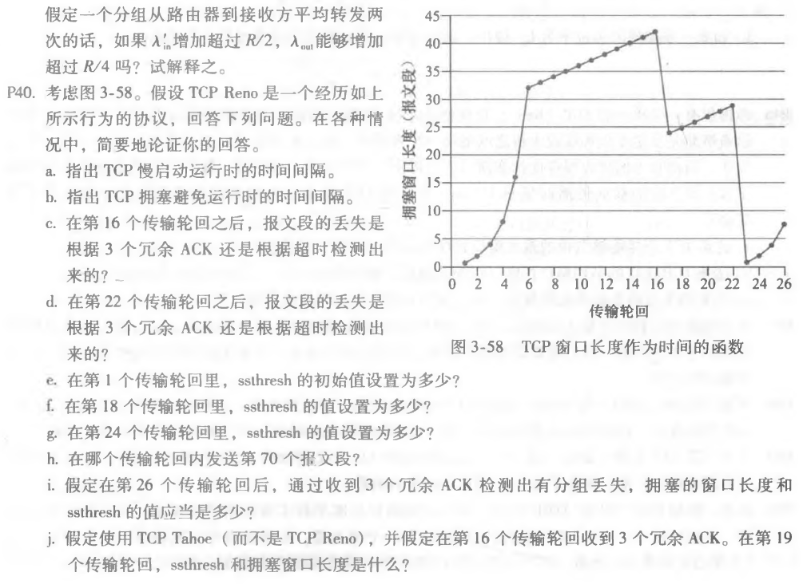
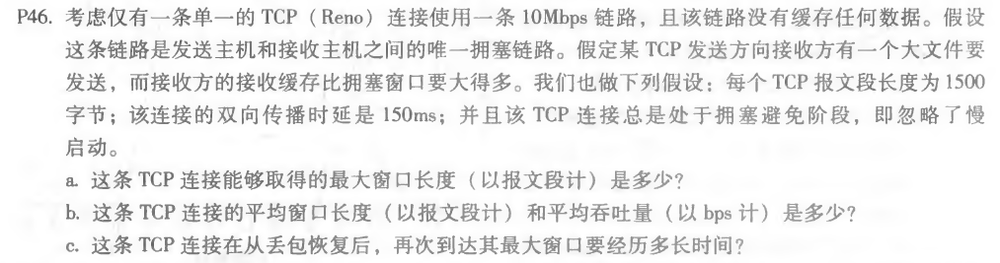

### 第六次作业

* * *

#### P40

##### 题目：

##### 作答：
a.慢启动的时间间隔：[1,6]和[23,26]。

b.拥塞避免时间间隔：[6,16]和[17,22]。

c.第16次传输循环之后，报文段丢失是根据3个冗余ACK检测出来的。

因为如果是根据超时检测，则拥塞窗口大小将下降到1。

d.第22次传输循环后，由于拥塞窗口大小设置为1，所以是根据超时而检测到段丢失。

e.在第1个传输轮回里，ssthresh的初始值是32。因为它是慢启动停止时窗口大小，并且此时拥塞避免开始。

f.在第18个传输轮回里，ssthresh的值是21。当分组丢失时阈值被设置为拥塞窗口的值的一半。而此前拥塞窗口为42，故取一半21。

g.在第24个传输轮回里，ssthresh的值是14。当分组丢失时阈值被设置为拥塞窗口的值的一半。而此前拥塞窗口为29，故取一半14.5,取下限14。

h.由图可得：在第1次传输循环期间，数据包1被发送；数据包2-3在第2次发送中发送传输循环；数据包4-7在第3传输循环中发送；数据包8-15在第4个传输回合中发送；数据包16-31在第5个传输中发送数据包32-63在第6个传输回合中发送；数据包64-96被发送在第7次传输循环中。

因此，在第7个传输轮回中发送第70个报文段。

i.ssthresh值将设置为拥塞窗口8的一半，即4。

而拥塞窗口长度将设置为8/2+3 = 7。

j.此前拥塞窗口为42，取一半21，故其ssthresh值为21。

而由于使用TCP Tahoe，拥塞窗口长度将下降到1，所以拥塞窗口长度为1。

k.由于使用TCP Tahoe，第17个传输轮回拥塞窗口长度将下降到1。

而ssthresh值为21，所以在第22个传输轮回发送的报文段为21个。

将第17-22个传输轮回的报文段累加起来：

1+2+4+8+16+21 = 52个

* * *

#### P46

##### 题目：

##### 作答：
a.由公式： 最大窗口长度*每个TCP报文段长度/RTT=链路吞吐量

可得：最大窗口长度*1500字节/0.15s=10Mbps

计算得：最大窗口长度约等于125个报文段。

b.由于该TCP连接处于拥塞避免阶段，忽略了慢启动。

故拥挤窗口大小在W/2~W之间变化

平均窗口大小为0.75W=93.75，取94个报文段。

平均吞吐量为94*1500字节/0.15s=7.52 Mbps

c.当数据包丢失时，W变为W/2，即125/2=62。

则再次达到最大的窗口要经历的时间为(125-62)*0.15s=9.45秒.

* * *

#### P48

##### 题目：

##### 作答：
a.由公式： 最大窗口长度*每个TCP报文段长度/RTT=链路吞吐量

可得：最大窗口长度*1500字节/0.15s=10Gbps

计算得：最大窗口长度约等于125000个报文段。

b.由于该TCP连接处于拥塞避免阶段，忽略了慢启动。

故拥挤窗口大小在W/2~W之间变化

平均窗口大小为0.75W=93750，取94个报文段。

平均吞吐量为93750*1500字节/0.15s=7.5 Gbps

c.当数据包丢失时，W变为W/2，即125000/2=62500。

则再次达到最大的窗口要经历的时间为(125000-62500)*0.15s=9375秒.

为了加快窗口增长的速度，我们可以将窗口大小增加一个更大的值，而不是在每个RTT中只增加一个窗口大小。要解决该问题，可以尝试使用高速TCP。

* * *
