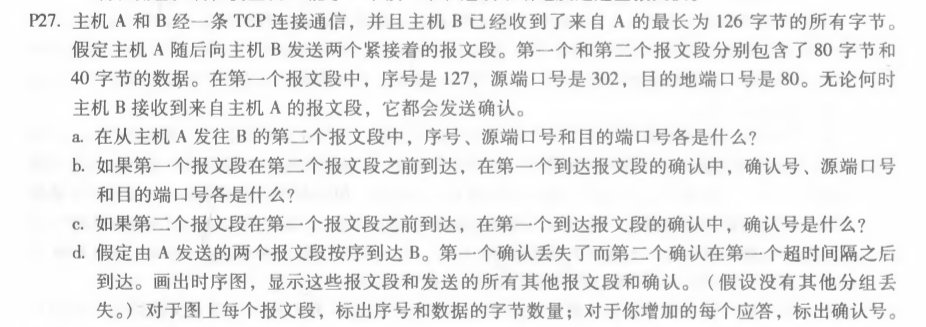
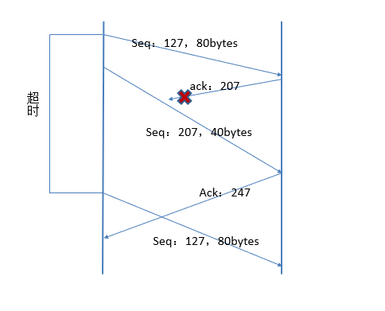
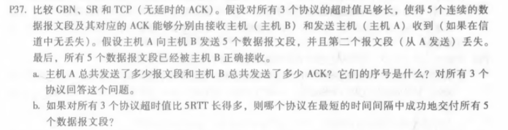
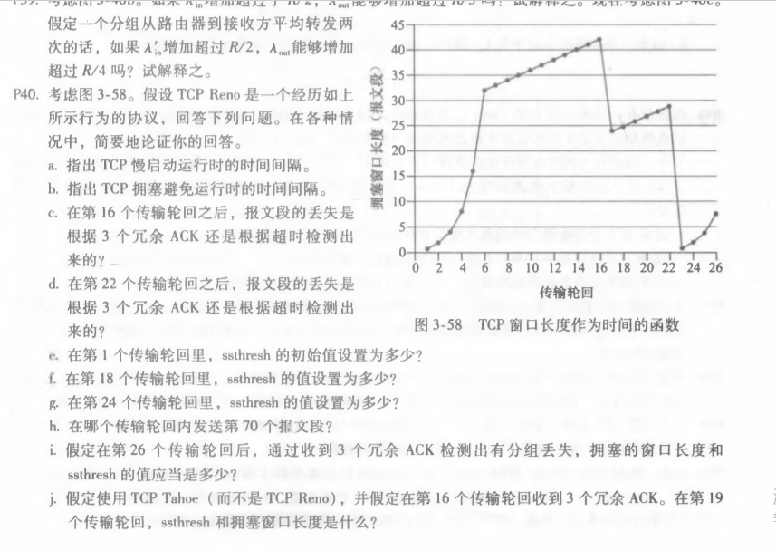
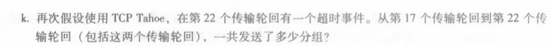

# 作业六

#### 计算机网络（自顶向下)第三章课后习题练习（电子版p207起，书本p189起）

###### 1，p27

答：a.序号207，源端口号302，目的端口号80

​		b.确认号207，源端口号80，目的端口号302

​		c.第二个报文段到达了，第一个没到达，B第一个发出的确认中，确认号：127

​		d.

###### 2，p37

答：对于GBN：

a.A：首先发送分组12345，后来重发2345，共9个分组

​	B：首先发送 ACK 1111，后来发送 2345，总共 8个 ACK

​	对于SR：
​	A：首先发送分组 12345，后来重发 2，总共 6 个分组

​	B：首先发送 ACK 1345，后来发送 2，总共 5 个 ACK

​	TCP：
​	A：首先发送分组 12345，后来重发 2，总共 6 个分组

​	B：首先发送 ACK 2222，后来发送 6，总共 5 个 ACK

b.
GBN、SR 需要等待超时，而 TCP 使用快速重传，故 TCP 最快

###### 3，p40

答：a.慢启动的时间间隔为[1,6],[23,26]

​		b.避免拥塞的时间间隔[6,16],[17,22]

​		c.根据三个冗余的ACK超时检测出来的

​		d.根据超时检测出来的

​		e.32

​		f.42/2=21

​		g.29/2=14

​		h.1+2+4+8+16+32=63,所以第七个传输发送第70个报文段

​		i.ssthresh的值为4，cwnd = ssthresh + 3MSS = 7

​		j.ssthresh=21，拥塞窗口长度为1,在第十九个轮回cwnd变为3+1=4

​		k.1+2+4+8+16=31(从17到21个轮回)

​		第22个轮回是16*2=32>ssthresh=21，取21

​		所以最终为31+21=52

​		