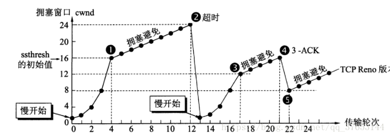

# TCP连接拥塞控制的模拟演示

#### 提示

* 慢开始
    发送方维护拥塞窗口cwnd的状态变量，其值取决于网络的拥塞程度，并且动态变化。
    发送方将拥塞窗口作为发送窗口，即swnd = cwnd
    发送方维护慢开始门限ssthresh状态变量
    * 当cwnd < ssthresh时，使用慢开始算法
    * 当cwnd > ssthresh时，停止使用慢开始算法而改用拥塞避免算法
    * 当cwnd == ssthresh时，既可以使用慢开始算法，也可以使用拥塞避免算法
* 拥塞避免
    也就是每个传输轮次，拥塞窗口cwnd只能线性加一，而不是像慢开始算法时那样——每个传输轮次，拥塞窗口cwnd按指数增长。
* 快重传
    就是使发送方尽快进行重传。
    具体是：发送方收到了累计3个连续的重复确认，就将行营的报文段立即重传，而不是等待超时重传计时器。
* 快恢复
    发送方收到了累计3个重复确认，知道了有报文段丢失，执行快恢复算法。
    具体是：发送方将ssthresh和cwnd值调整为当前的一半，开始使用拥塞避免算法；注意另有将cwnd=ssthresh+3的做法。
* 拥塞避免算法假设由比特错误导致丢包的概率很小（远小于1%），因此有丢包发生就认为从发送方到接收方的传输路径中必然有某处出现了拥塞。为了方便演示，**本程序假设只有在cwnd > ssthresh时有10%概率发生丢包或超时**。

#### tcp阻塞模拟类 & 画图代码(另见：tcp.ipynb)

```python
import random

class TcpImitation:
    # 拥塞窗口状态变量
    cwnd = 1
    cwnd_max = 1
    cwnd_list = []
    # 开始门限
    ssthresh = 0
    ssthresh_list = []
    # 状态
    state_list = []
    
    def __init__(self,ssthresh,cwnd):
        self.ssthresh = ssthresh
        self.cwnd = cwnd

    def transport_info(self):
        if self.cwnd >= self.ssthresh:
            random_state = random.randint(0,19)
            if random_state == 0:                    # time_out
                print(random_state)
                self.ssthresh = int(self.cwnd / 2)
                self.cwnd = 1
                self.print_process("time_out")
            elif random_state == 1:                  # loss
                print(random_state)
                self.ssthresh = int(self.cwnd / 2)
                self.cwnd = self.ssthresh+3
                self.print_process("loss")
            else:                                    # good job
                self.cwnd += 1
                self.print_process("normal")
        elif self.cwnd + self.cwnd > self.ssthresh:
            self.cwnd = self.ssthresh
            self.print_process("normal")
        elif self.cwnd == 0:
            self.cwnd += 1
            self.print_process("normal")
        else:
            self.cwnd += self.cwnd
            self.print_process("normal")
    
    def print_process(self, state_str):
        if self.cwnd > self.cwnd_max:
            self.cwnd_max = self.cwnd
        self.cwnd_list.append(self.cwnd)
        self.ssthresh_list.append(self.ssthresh)
        self.state_list.append(state_str)
        print("STATE:" + state_str + "\tCWND:" + str(self.cwnd) + "\tSSTHRESH:" + str(self.ssthresh))
```

```python
import numpy as np
import matplotlib as mpl
import matplotlib.pyplot as plt
import matplotlib.font_manager as fm


def start_plot(tcpImitation: TcpImitation):
    plt.figure(figsize=(20, 16), dpi=80)
    plt.ion()
    
    for i in range(0, 50):
        tcpImitation.transport_info() # flush sourse value
        
        lenth = len(tcpImitation.cwnd_list)
        plt.cla()                     # clear old dates on plt-form

        plt.title("TCP IMITATION")
        plt.grid(True)

        x = list(map(lambda x:x+1,range(lenth)))
        y_cwnd = tcpImitation.cwnd_list
        y_ssthresh = tcpImitation.ssthresh_list

        # pre-set X & Y label here
        plt.xlabel("RTT")
        plt.xlim(0, 50)
        plt.xticks(np.linspace(0, 50, 51))
        hight = tcpImitation.cwnd_max + 5 # dynamic Y-axis value
        plt.ylabel("VALUE")
        plt.ylim(0, hight)
        plt.yticks(np.linspace(0, hight, hight+1))

        # draw CEND & SSTHRESH lines
        plt.plot(x, y_cwnd, c='r', ls='-', label="CWND")
        plt.plot(x, y_ssthresh, c='b',ls='--', label="SSTHRESH")

        # loction [upper, lower, left, right, center]
        plt.legend(loc="upper left", shadow=True)
        plt.pause(0.2)

    plt.ioff()
    plt.show()
    return
```

```python
start_plot(TcpImitation(16,0))
```

以下为一个示例图像：


参考对比（注意与下图不同的是，代码中为cwnd=ssthresh+3的做法）：

