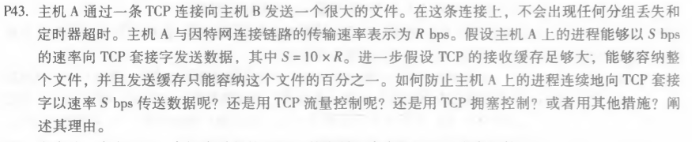
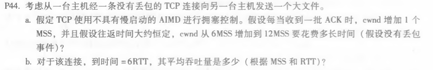
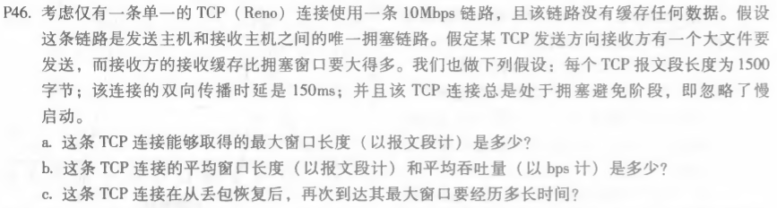

#### P43

答：1.如果接受缓存足够大，则无需进行流量控制

​		2.没有丢包、超时，无需拥塞控制。

​		3.发送缓存满载时就会自动慢下来，无需进行控制

#### P44

答：a.需要6个RTT

​		b.6+7+8+9+10+11=51MSS

​			51MSS/6RTT=8.5MSS/RTT

#### P46

答：a.最大窗口长度为：W=10Mbps*RTT/MSS=125

​		b.平均窗口长度：0.75W=94

​			平均吞吐量：94*1500*8/0.15=7.52Mbps

​		c.相当于从W/2到W	需要（125-62）*RTT=9.45s

