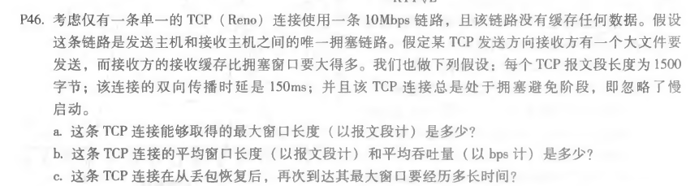
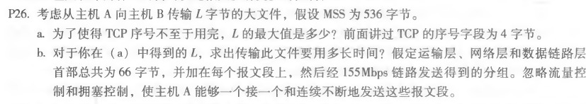

# 第六次作业

任选三题课后习题，包含一题拥塞控制的：

+ P46(关于拥塞控制的题目)

​	a. 假设TCP连接能取得的最大窗口长度为*maxW*，由题意知：10Mbps = maxW * 1500 * 8/(150 * 10^(-3))，解出maxW = 125报文段。

​	b. 拥塞窗口大小从maxW/2到maxW之间变化，可以简单认为平均窗口大小是(1 + 1/2)/2   = 0.75maxW = 93.8报文段。平均吞吐量：93.8 * 1500 * 8/0.15 = 7.5Mbps

​	c. 丢包会导致TCP触发拥塞控制，窗口会从W降到W/2。如果之前保持最大窗口125，拥塞控制后就会只有62，如果此时开始恢复，后续采用线性增大的策略，那么需要125 - 62 = 63个RTT。

+ P28（关于流量控制）

  

  由于链路容量只有100Mbps，主机A的发送速率也不能超过100Mbps。即便如此，B接受的速率也比A发送的快，是一种"供过于求"的状态。同时考虑A传来的数据填充缓存以及B从缓存中读出数据的过程，可以理解为缓存以50Mbps的速度被填充。假设缓存大小为BufSize, 那么BufSize/50 秒的时候，B就需要设置接收窗口为0，使得A暂时停止发送。直到A收到的报文段中接收窗口再度大于0，A才开始发送。TCP流量控制使得A不断处于发送和停止状态，依据的指标是报文段中接收窗口的大小。

+ P26

  

  a. 序列号用32位整数表示，那么最多有2^32个序列号。但是序列号并不随着报文段线性增加，而是随着**字节**而增加。所Lmax = 2^32字节，等于4 294 967 296（字节）。

  b. 总共有2^32/536 = 8,012,999个报文段，下层添加的首部也就是66 * 8,012,999 = 528,857,934字节。因此传输的总字节数 =2^32 + 528,857,934 = 4.82x10^9（字节）=3.88 G（字节）。所以传输文件总时间：

  3.88G / 155M =  250.32秒，