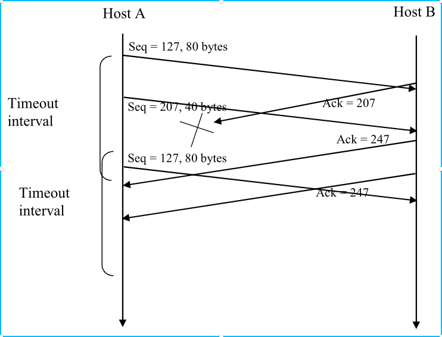

P25:
- 假如在传输协议上发送应用消息。
  - 使用TCP时，应用程序将数据写入连接发送缓冲区，TCP将抓取字节必须在TCP段中放置一个消息；TCP可能会或多或少地发送消息而不是在段中的单个消息。
  - UDP封装在无论应用程序给出什么，都会分段；因此，如果应用程序提供UDP应用消息，此消息将是UDP段的有效负载。因此，对于UDP，应用程序对数据段中的数据进行了更多控制。
- 由于流量控制和拥塞控制，TCP由于流量控制和拥塞控制，可能会有显著的延迟从应用程序向其发送缓冲器写入数据直到数据被指定给网络层。UDP由于流控制而没有延迟。

p27
- 主机A到B的第二段中，序列号为207，源端口号为302，目的端口号为80
- 确认号为207，所述源端口号为80，所述目的端口号为302。
- 确认号为127，仍在等待第一段报文。
- 

p28：
- 
  - 由于链路容量只有100 Mbps，所以主机A的发送速率最多可达100 Mbps。不过，主机A向接收缓冲区发送数据的速度比主机B从缓冲区中取出数据的速度要快。接收缓冲区的取出速率约为40 Mbps。
  - 当缓冲区已满时，主机B通过设置RcvWindow=0向主机A发送停止发送数据的信号。然后主机A停止发送，直到接收到RcvWindow>0的TCP段为止。
  - 主机A将参考RcvWindow值，反复停止并开始发送从主机B接收。
