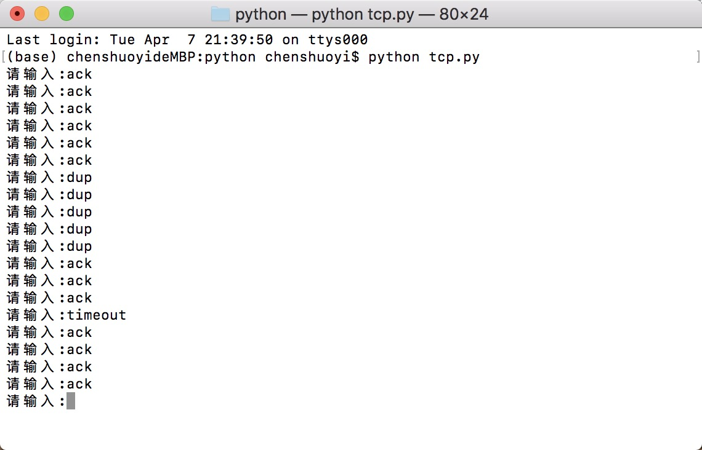
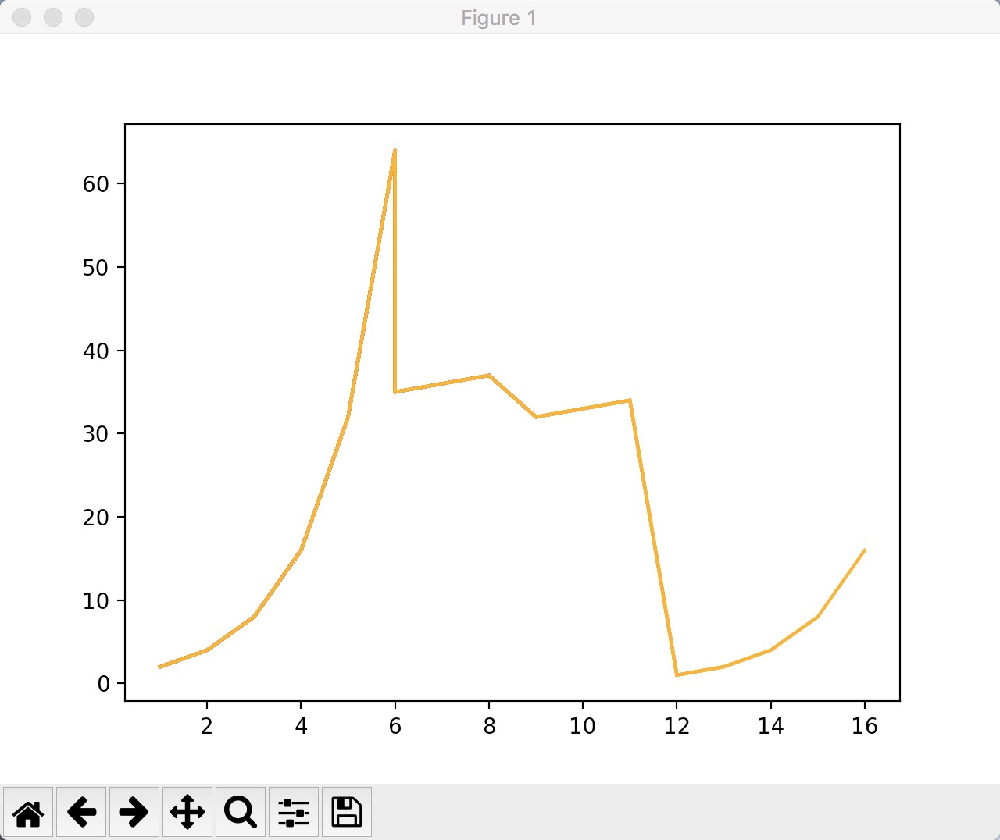

## 演示TCP拥塞控制的小程序

python代码：

```python
#TCP拥塞控制
import matplotlib.pyplot as plt

#初始值
cwnd = 1
ssthresh = 64
count = 0
dupACKcount = 0

#慢启动
def slow_start():
    global cwnd
    cwnd = cwnd*2
    return cwnd

#拥塞避免
def congestion_avoidance():
    global cwnd
    cwnd = cwnd + 1
    return cwnd

#快恢复
def fast_recovery():
    global cwnd
    cwnd = cwnd + 1
    return cwnd


plt.ion()
plt.figure(1)
x_list = []
result_list = []
x = 0 # x轴
y = 0 # y轴
char =input("请输入:")
state = 0 # 当前状态 0：慢启动  1：拥塞避免  2：快恢复


while char!="":
    if state == 0: # 慢启动状态
        
        if char=="timeout": # 超时
            ssthresh = cwnd / 2
            cwnd = 1
            dupACKcount = 0
            y = cwnd
            result_list.append(y)
            x += 1
            x_list.append(x)
            plt.plot(x_list, result_list, c='orange')  # 保存历史数据
            plt.show()
            char = input("请输入:")
        elif char=="ack": # 收到一个新的ACK
            x += 1
            x_list.append(x)
            y = slow_start()
            dupACKcount = 0
            result_list.append(y)
            plt.plot(x_list, result_list, c='orange')  # 保存历史数据
            plt.show()
            if cwnd >= ssthresh:
                state = 1 # 状态转换为拥塞避免
            char = input("请输入:")
        elif char == "dup":# 收到重复的ACK
            dupACKcount = dupACKcount + 1
            if dupACKcount==3: # 重复确认次数为3
                ssthresh = cwnd / 2
                cwnd = ssthresh + 3
                state = 2  # 状态转换为快恢复
                y = cwnd
                x_list.append(x)
                result_list.append(y)
                plt.plot(x_list, result_list, c='orange')  # 保存历史数据
                plt.show()
            char = input("请输入:")


    elif state == 1: # 拥塞避免状态
        
        if char=="timeout": # 超时
            ssthresh = cwnd / 2
            cwnd = 1
            dupACKcount = 0
            state = 0
            y = cwnd
            result_list.append(y)
            x += 1
            x_list.append(x)
            plt.plot(x_list, result_list, c='red')  # 保存历史数据
            plt.show()
            char = input("请输入:")
        elif char=="ack": # 收到一个新的ACK
            x += 1
            x_list.append(x)
            y = congestion_avoidance()
            result_list.append(y)
            dupACKcount = 0
            plt.plot(x_list, result_list, c='red')  # 保存历史数据
            plt.show()
            char = input("请输入:")
        elif char == "dup":# 收到重复的ACK
            dupACKcount = dupACKcount + 1
            if dupACKcount == 3: # 重复确认次数为3
                ssthresh = cwnd / 2
                cwnd = ssthresh + 3
                state = 2  # 状态转换为快恢复
                y = cwnd
                result_list.append(y)
                x_list.append(x)
                plt.plot(x_list, result_list, c='red')  # 保存历史数据
                plt.show()
            char = input("请输入:")

    else: # 快恢复状态
        if char=="timeout": # 超时
            ssthresh = cwnd / 2
            cwnd = 1
            dupACKcount = 0
            state = 0
            y = cwnd
            result_list.append(y)
            x += 1
            x_list.append(x)
            plt.plot(x_list, result_list, c='blue')  # 保存历史数据
            plt.show()
            char = input("请输入:")
        elif char=="ack": # 收到一个新的ACK
            cwnd = ssthresh
            dupACKcount = 0
            y = cwnd
            result_list.append(y)
            x += 1
            x_list.append(x)
            state = 1
            plt.plot(x_list, result_list, c='blue')  # 保存历史数据
            plt.show()
            char = input("请输入:")
        elif char == "dup":# 收到重复的ACK
            x += 1
            x_list.append(x)
            y = fast_recovery()
            result_list.append(y)
            dupACKcount = 0
            plt.plot(x_list, result_list, c='blue')  # 保存历史数据
            plt.show()
            char = input("请输入:")


```

输入命令：



绘制出的图像：

