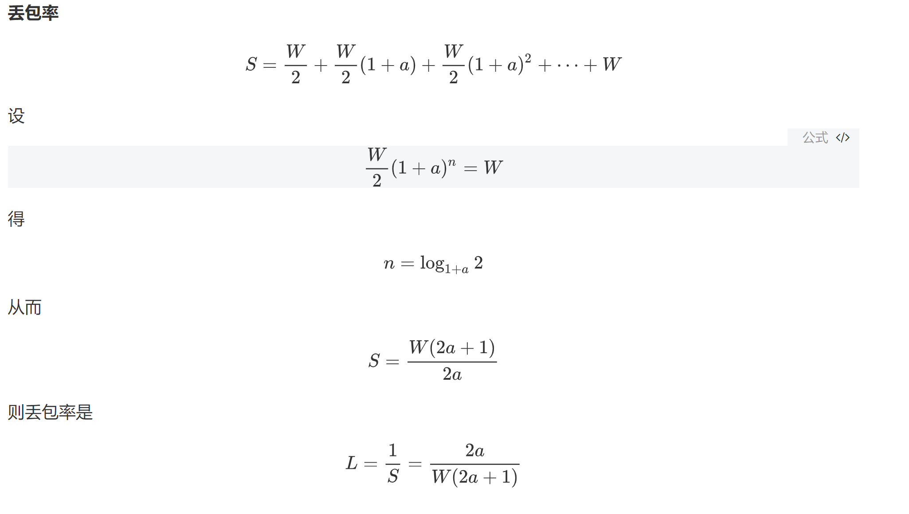

#### 课后习题

#### ①第37题

* 比较GBN、SR和TCP （无延时的ACK）。假设对所有3个协议的超时值足够长，使得5个连续的数据报文段及其对应的ACK能够分别由接收主机（主机B）和发送主机（主机A）收到（如果在信道中无失）。假设主机A向主机B发送5个数据报文段，并且第二个报文段（从A发送）丢失。最后，所有5个数据报文段已经被主机B正确接收。*

**a.** 主机A总共发送了多少报文段和主机B总共发送了多少ACK?它们的序号是什么？对所有3个协议回答这个问题。

**b.** 如果对所有3个协议超时值比5RTT长得多，则哪个协议在最短的时间间隔中成功地交付所有5个数据报文段？

**a.**
**GBN：**
A：首先发送分组 12345，后来重发 2345，总共 9 个分组
B：首先发送 ACK 1111，后来发送 2345，总共 5 个 ACK

**SR：**
A：首先发送分组 12345，后来重发 2，总共 6 个分组
B：首先发送 ACK 1345，后来发送 2，总共 5 个 ACK

**TCP：**
A：首先发送分组 12345，后来重发 2，总共 6 个分组
B：首先发送 ACK 2222，后来发送 6，总共 5 个 ACK

**b.**

GBN、SR 需要等待超时，而 TCP 使用快速重传，故 TCP 最快

#### ②第46题

考虑仅有一条单一的TCP （Reno）连接使用一条10Mbps链路，且该链路没有缓存任何数据。假设这条链路是发送主机和接收主机之间的唯一拥塞链路。假定某TCP发送方向接收方有一个大文件要发送，而接收方的接收缓存比拥塞窗口要大得多。我们也做下列假设：每个TCP报文段长度为1500 字节；该连接的双向传播时延是150ms；并且该TCP连接总是处于拥塞避免阶段，即忽略了慢启动。

a. 这条TCP连接能够取得的最大窗口长度（以报文段计）是多少？

b. 这条TCP连接的平均窗口长度（以报文段计）和平均吞吐量（以bps计）是多少？
c. 这条TCP连接在从丢包恢复后，再次到达其最大窗口要经历多长时间？

**a.**
最大窗口长度 W 受限于链路速率：W * MSS / RTT = 10Mbps
得到 W = 125

**b.**
从 W/2 到 W：
平均窗口长度为 0.75W = 94
平均吞吐量为 94 * 1500 * 8 / 0.15 = 7.52Mbps

**c.**
W’ = W/2 + 3 = 65
从 W’ 到 W：
(125-65)*150ms = 9s

#### ③第52题

考虑修改TCP的拥塞控制算法。不使用加性增，使用乘性增。无论何时某TCP收到一个合法的ACK,就将其窗口长度增加一个小正数a （0<a<1）。求出丢包率L和最大拥塞窗口 W之间的函数关系。论证：对于这种修正的TCP,无论TCP的平均吞吐量如何，一条TCP连接将其拥塞窗口长度从W/2增加到W，总是需要相同的时间。

**丢包率**
$$
S=\frac{W}{2}+\frac{W}{2}(1+a)+\frac{W}{2}(1+a)^2+\cdots+W
$$
设
$$
\frac{W}{2}(1+a)^n=W
$$
得
$$
n=\log_{1+a}2 
$$
从而
$$
S=\frac{W(2a+1)}{2a}
$$
则丢包率是
$$
L=\frac{1}{S}=\frac{2a}{W(2a+1)}
$$

写了好久写出来的公式，免得显示不出来

**相关性**

从**W**/2增加到**W**需要得时间是
$$
n*RTT=log_{1+a}2*RTT
$$
跟吞吐量是无关的
