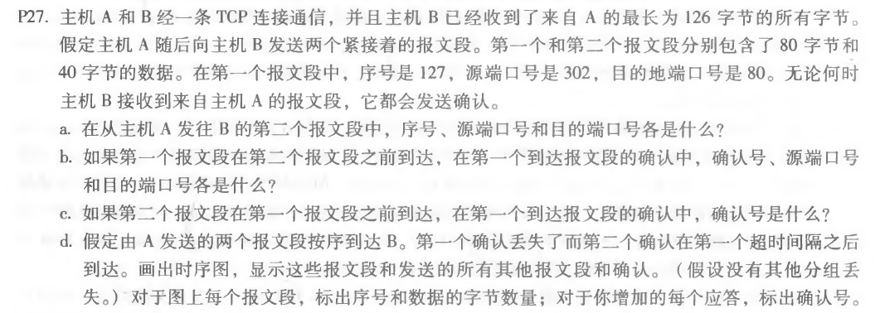
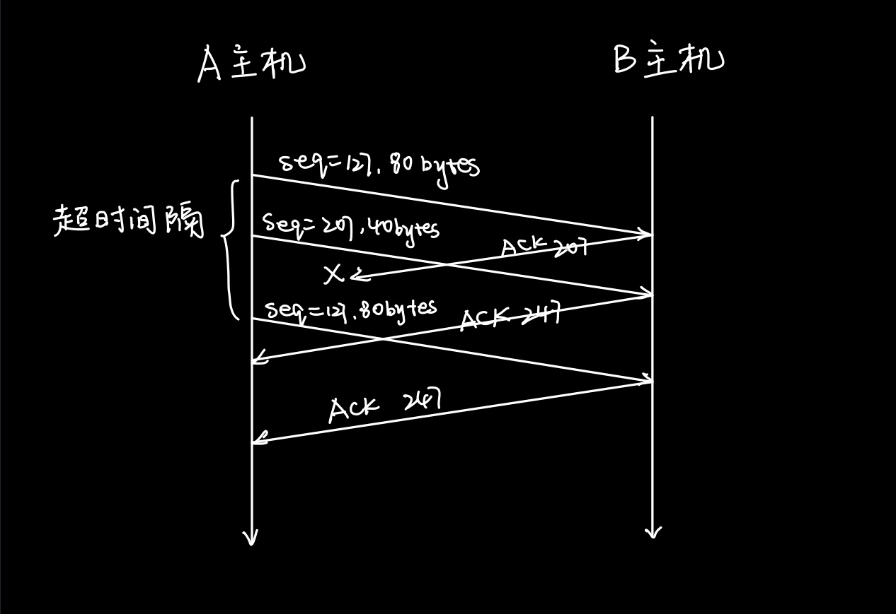
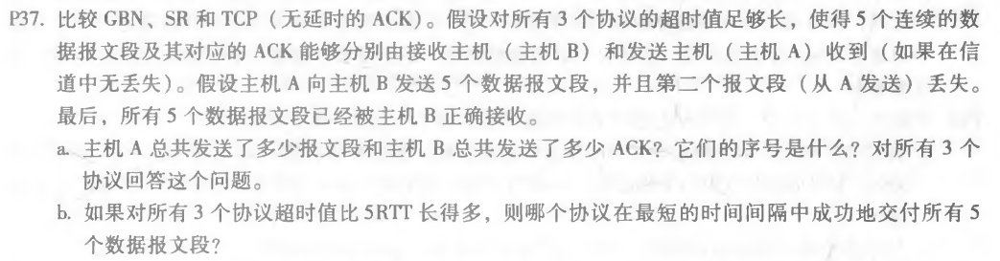
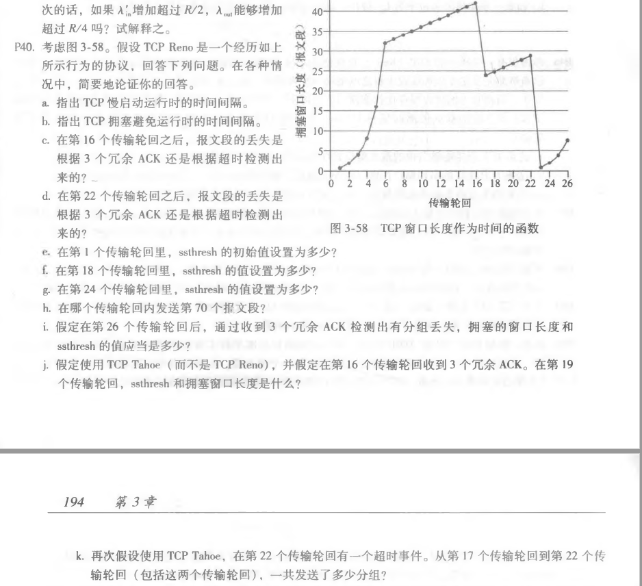

## Homework_6

**Author：**

姓名： 王泽生

学号：2017302580268

第三章习题：**P27、P37、P40**

### P27

**解答：**

a：序号：207，源端口号：302，目的端口号：80

b：确认号：207，源端口号：80，目的端口号：302

c：确认号：127

d：

### P37

**解答：**

a：

1. GBN：

   A 总共发送 9 个报文段，序号为：123452345

   B 发送 8 个报文段，序号为：11112345

2. SR：

   A发送6个报文段，序号是123452

   B发送5个ACK，序号是13452  

3. TCP：

   A发送6个报文段，序号是123452

   B发送5个ACK，序号是22226 

b：

TCP最快，因为TCP协议中A在收到3个冗余ACK序号2时就会快速重传2号报文段，但是SR协议需要等待超时再发送 

### P40

**解答：**

a： 1-6 传播轮回和 23-26 传播轮回

b：6-16传播轮回和 17-22传播轮回

c：根据 3 个冗余 ACK

d：根据超时检测

e：32

f：21

g：14

h： 

在前 6 个传输轮回为慢启动：1+2+4+8+16+32=63<70 

第7个传输轮回为拥塞避免运行：70<63+33=96 

故在第 7 个传输轮回里发送第 70 个报文段 

i： 拥塞的窗口长度为4+3=7，ssthresh值为 8/2=4 

j： 第16个传输轮回后，ssthresh值变为 42/2=21，拥塞窗口长度变为1，下个传输轮回变为2，在第19个变为4 

k： 从第17个传输轮回开始：1+2+4+8+16+21=52个 

