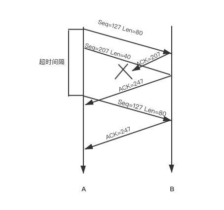
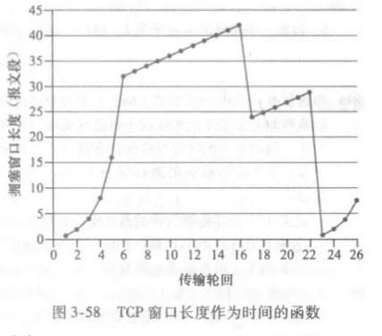
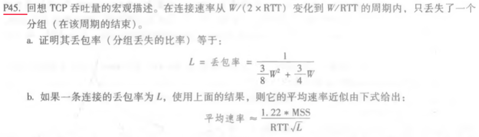
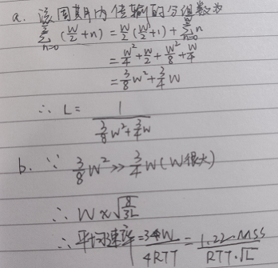
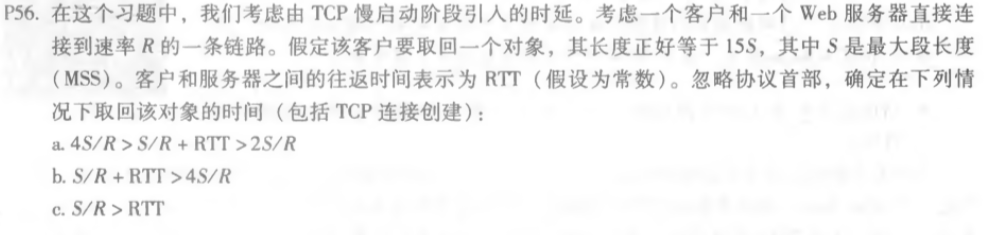
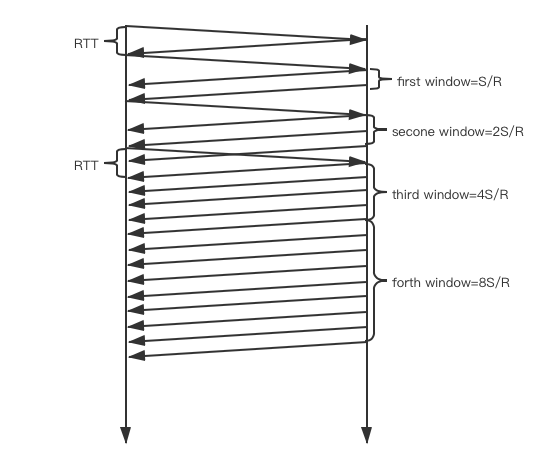

## 课后题

### **P27**

主机A和B经一条TCP连接通信，并且主机B已经收到了来自A的最长为126字节的所有字节。假定主机A随后向主机B发送两个紧接着的报文段。第一个和第二个报文段分别包含了80字节和40字节的数据。在第一个报文段中，序号是127,源端口号是302,目的地端口号是80。无论何时主机B接收到来自主机A的报文段，它都会发送确认。

* a.在从主机A发往B的第二个报文段中，序号、源端口号和目的端口号各是什么? 

  207	302	80

*  b.如果第一个报文段在第二个报文段之前到达，在第一个到达报文段的确认中，确认号、源端口号和目的端口号各是什么?

  207	80	302

* c.如果第二个报文段在第一个报文段之前到达，在第一个到达报文段的确认中，确认号是什么? 

  127

* d.假定由A发送的两个报文段按序到达B。第一个确认丢失了而第二个确认在第一个超时间隔之后 到达。画出时序图，显示这些报文段和发送的所有其他报文段和确认。 (假设没有其他分组丢失)对于图上每个报文段，标出序号和数据的字节数量;对于你增加的每个应答，标出确认号。

### **P40**

考虑图3-58，假设TCP Reno是一个经历如上所示行为的协议，回答下列问题。在各种情况中，简要地论证你的回答。

* a.指出TCP慢启动运行时的时间间隔。

  1s-6s 23s-26s

* b.指出TCP拥塞避免运行时的时间间隔。

  16s-17s 22s-23s

* c.在第16个传输轮回之后，报文段的丢失是根据3个冗余ACK还是根据超时检测岀来的? 

  3个冗余ACK检测出来的,由于cwnd没有变为1

* d.在第22个传输轮回之后，报文段的丢失是根据3个冗余ACK还是根据超时检测出
   来的? 

  超时检测出来的,cwnd变为1

* e.在第1个传输轮回里，ssthresh的初始值设置为多少?

  32

* f.在第18个传输轮回里，ssthresh的值设置为多少? 

  21

* g.在第24个传输轮回里，ssthresh的值设置为多少? 

  14

* h.在哪个传输轮回内发送第70个报文段?

  前6个轮回发送了63个报文段，第7个轮回可以发送33个，所以在第7个轮回发送第70个报文段

* i.假定在第26个传输轮回后，通过收到3个冗余ACK检测出有分组丢失，拥塞的窗口长度和ssthresh的值为多少？

  ssthresh = 4，cwnd = ssthresh + 3MSS = 7

* j.假定使用TCP Tahoe (而不是TCP Reno), 并假定在第16个传输轮回收到3个冗余ACK。在第19个传输轮回，ssthresh和拥塞窗口长度是什么?

  ssthresh = 21, cwnd = 4

* k.再次假设使用TCP Tahoe,在第22个传输轮回有一个超时事件。从第17个传输轮回到第22个传输轮回(包括这两个传输轮回)，一共发送了多少分组?

  1+2+4+8+16+21=52

### **P45**

### **P56**

分析:这题主要考察慢启动的知识点,接收端每次只能以S长度发送报文,所以在接收到第二个窗口第一个报文段时就会接着请求之后的信息,此时就要看接收端是否还在发送报文段,若是则等待,若不是则开始传.

a.此条件下如上图,第二个窗口传第一个报文返回时第三个窗口开始,第三个窗口第一个报文返回时该窗口还在传输,所以时间为:

RTT + RTT + S/R + RTT + S/R + RTT + 12S/R = 4RTT + 14S/R

b.此条件下,因为RTT>3S/R,一二、二三窗口的状态同a,第三个窗口和第四个窗口中间也有间隔,时间为:RTT + RTT + S/R + RTT + S/R + RTT + S/R + RTT + 8S/R = 5RTT +11S/R

c.此条件下,第二个窗口传第一个报文返回时第二个窗口还没结束,234窗口是挨着的,所以时间为:RTT + RTT + S/R + RTT + 14S/R = 3 RTT + 15S/R