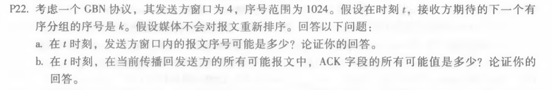
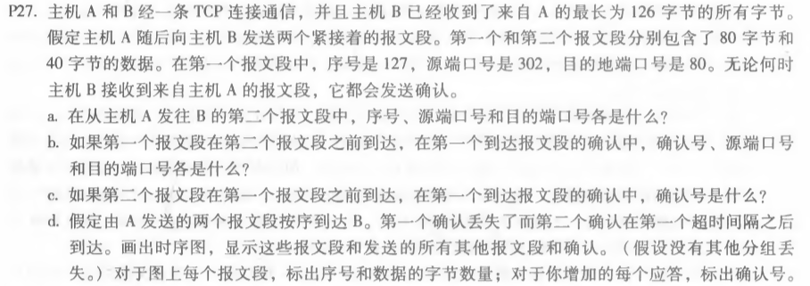
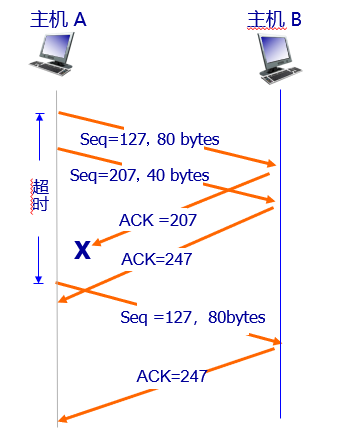
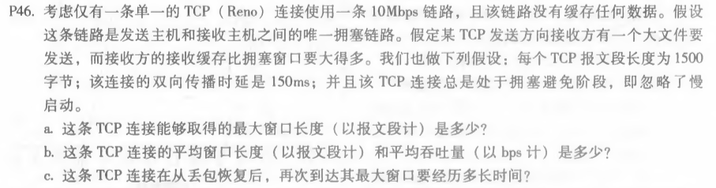

# 网络及分布式计算

## *第六次作业*

---------------------------------------------  
### 第三章课后习题任选三题  
#### P22  

  
#### 答：  
a. [k-4，k+3]  
  接收方期待的下一个分组序号为k，说明接收方接收了序号为k-1的分组，发送方已经发送了序号为k-4、k-3、k-2、k-1的分组。假设发送方没有收到返回的ACK，那么其窗口内的报文序号范围是[k-4，k-1]；假设发送方接收到返回的ACK，那么序号范围是[k，k+3]。  
b. [k-4，k-1]  
发送方能发送序号为k-1的分组，必然已经收到了序号为k-5的分组对应的ACK。所以发送的可能是序号为[k-4,k-1]分组对应的ACK。  
#### P27  

#### 答：  
a.  
序号：207；源端口号：302；目的端口号：80。  
b.    
序号：207；源端口号：80；目的端口号：302。  
c.  
127。  
d.  

#### P46  
    
#### 答:    
a.  
MSS=1500bytes，RTT=150ms，W*MSS/RTT=10Mbps  
解得Wmax=125  
b.   
平均窗口长度为 W'=0.75W = 94，平均吞吐量为 94 * 1500bytes / 150ms = 7.52Mbps  
c.   
丢包后窗口变为原来的一半，t=(1-1/2)Wmax*RTT=9375ms

