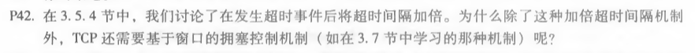
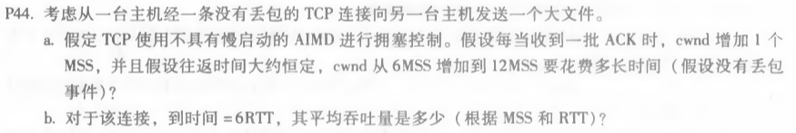
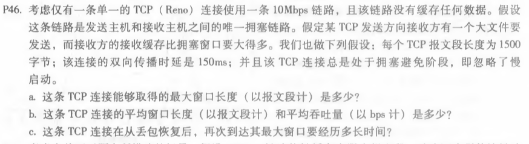

## P42
 

拥塞是解决的当前接收窗口很大，但是发送速率却不能很大的情况。即使端到端路径非常拥挤，超时间隔的加倍不会阻止TCP发送者向网络发送大量第一时间传输的数据包，这种情况超时时间加倍并不能解决。

## P44

1) 可以知道，每一个RTT都将增加一个MSS，所以要花费12-6=6RTT 
2) 平均吞吐量为(6+7+8+9+10+11)/6=8.5MSS/RTT 

## P46

1)1个RTT发送的字节数为10Mbps*150ms = 1.5Mb,窗口长度最大为1.5Mb/(1500*8bit) = 125 
2)平均窗口为长度最大为(1+1/2)/2*125=93.75,平均吞吐量93.75*(1500*8/0.15)bps=7.5Mbps 
3)恢复过程窗口从62到125，经历63个RTT，共63*0.15s=9.45s

 

 
刘涛 2017302580292 2020.04.09
