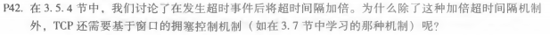
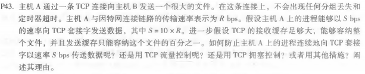
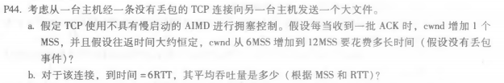

# 第六次作业
## 刘洋 2017302580294
P42: 
&emsp;超时仅能减缓分组未丢失超时重传这种情况，超时间隔的加倍不会阻止TCP发送者向网络发送大量第一时间传输的数据包，即使端到端路径非常拥挤。因此，当出现网络拥塞的迹象时，需要一种拥塞控制机制来阻止从上面的应用程序接收到的数据流。 
P43: 
由于接收器的接收,在溢出接收器中没有危险,缓冲区可以保存整个文件。 
TCP流量控制不行，因为接受的缓存足够大。 
TCP拥塞控制也不行，因为没有丢包、没有超时。 
措施：无需采用任何措施，当发送缓存满载时，自动就慢下来了。 
P44: 
(a)、因为每个RTT增加一个MSS，所以T = 12 - 6 = 6RTT 
(b)、平均吞吐量 = （6 + 7 + 8 + 9 + 10 + 11）/6 = 8.5 MSS/RTT