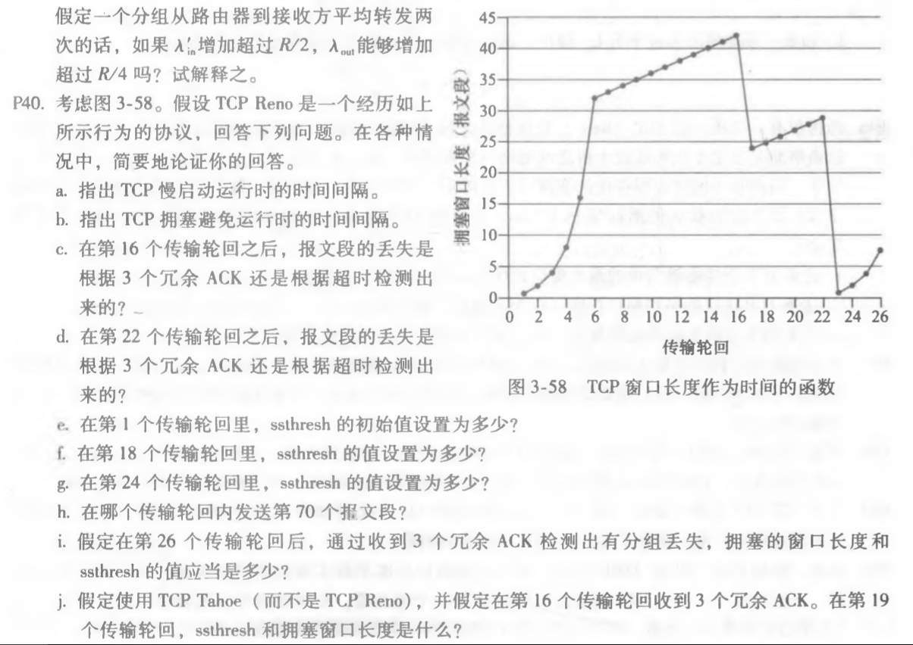
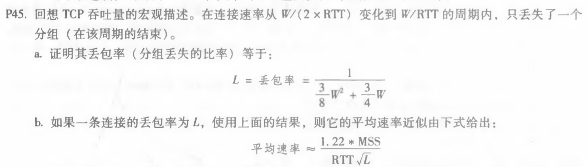
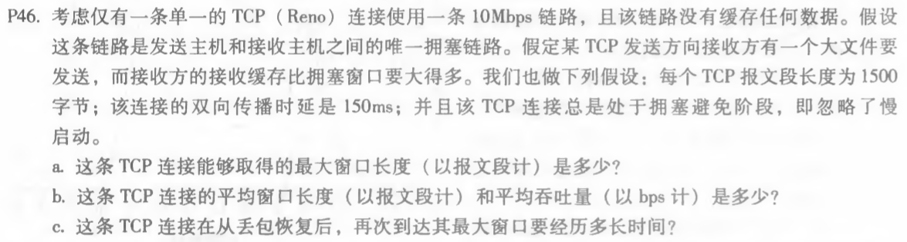

#### 1. P40

a. 慢启动时窗口长度呈指数型增长，因此时间间隔为[1,6]和[23,26]

b. 拥塞避免时窗口长度呈线性增长，因此时间间隔为[6,16]和[17,22]

c. 是根据3个冗余ACK，因为此时窗口大小不是下降为0

d. 是根据超时检测，因为此时窗口大小下降为0

e. 在第1个传输轮回，ssthresh初始值设定为2^5 = 32

f. 在第18个传输轮回，ssthresh值设定为42/2 = 21

g.在第24个传输轮回，ssthresh值设定为29/2 = 14

h. 由 1 + 2 + 4 + 8 + 16 + 32 = 63 < 70

​         1 + 2 + 4 + 8 + 16 + 32 + 33 = 96 > 70，因此第70个报文段在第7个轮回发送

i. ssthresh的值为8/2 = 4，拥塞的窗口长度为4 + 3 = 7

j.  ssthresh的值为42/2 = 21，拥塞的窗口长度重设为1

k. 发送分组数为1 + 2 + 4 + 8 + 16 + 21 = 52

#### 2. P45

a. 每个周期分组丢包数为
$$
\sum_{n=0}^{\frac{W}{2}}(\frac{W}{2} + n)
\\= (\frac{W}{2} + 1)\frac{W}{2} + \sum_{n=0}^{\frac{W}{2}}n
\\=  \frac{W^2}{4} + \frac{W}{2} + \frac{W^2}{8} + \frac{W}{4}
\\= \frac{3W^2}{8} + \frac{3W}{4}
$$
因此丢包率为
$$
L = \frac{1}{\frac{3W^2}{8} + \frac{3W}{4}}
$$

b. 当W足够大时，$ \frac{3W^2}{8}$ 远大于 $ \frac{3W}{4}$ ，因此L可近似取 $ \frac{8}{3W^2}$ ，得到
$$
W = \sqrt{\frac{8}{3L}}
$$
因此平均速率为
$$
\frac{3}{4}\sqrt{\frac{8}{3L}}\frac{MSS}{RTT}
\\ = \frac{1.22MSS}{RTT\sqrt{L}}
$$

#### 3. P46

a. 由
$$
W \frac{MSS}{RTT} = 10Mbps
$$
得到
$$
W = \frac{10Mbps * RTT}{MSS}
\\ = \frac{10 * 10 ^ 6 * 0.15}{1500 * 8} 
\\ = 125
$$
因此最大窗口长度是125个报文段大小。

b. 平均窗口长度为$ \frac{3W}{4}$ = 94个报文段大小

平均吞吐量为$\frac{3 * 10Mbps}{4} = 7.5Mbps$

c. 再次达到最大窗口需要$\frac{W}{2} * RTT = 9.375s$